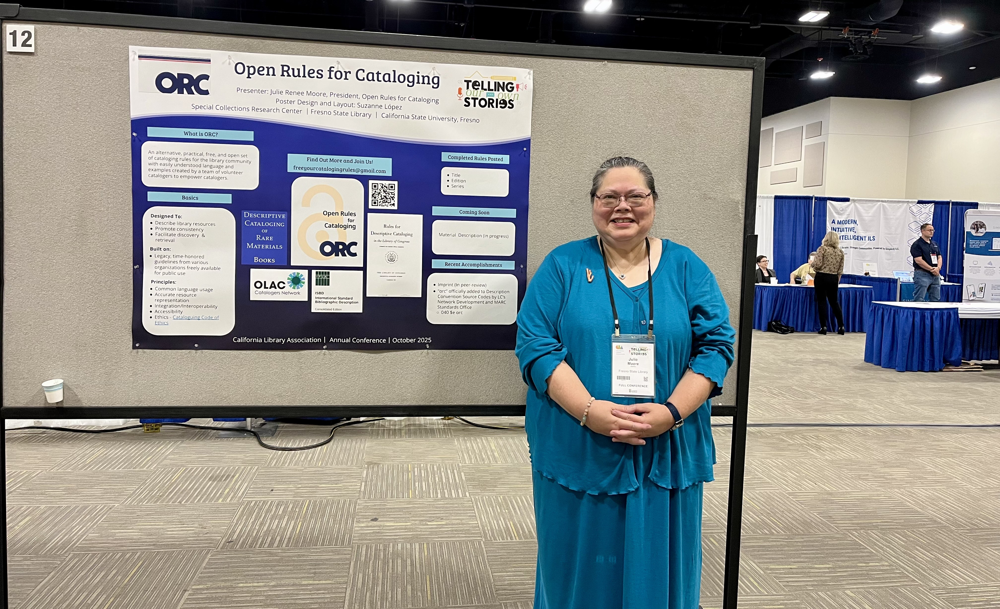

Presentations, podcasts, and project updates by ORC members since 2021. Updates can also be found on our [YouTube Channel](https://www.youtube.com/channel/UCWAxYoEdDJcUryqQxgLBprA){:target="_blank"}.

## 2025

[WolfCon (video)](https://www.youtube.com/watch?v=I6HqOM1H99U&list=PLMocoPoiGkwcUSiOjdssz_2iXrYwf7cR4&index=4){:target="_blank"} and 
[WolfCon (pdf)](https://drive.google.com/file/d/1oh5h-t8mwrTuSDjZkFPx_MUnR_wLCSHf/view?usp=drive_link){:target="_blank"}

Presenters: Lloyd Chittenden, Seth Huber, Natalie R. Kazmin
  
[Library and Archives of Canada (LAC) (pdf)](https://drive.google.com/file/d/1ykK8nM33TJM7VmUUS2IRicmMVpgsjEM1/view?usp=drive_link){:target="_blank"}

Presenters: Lloyd Chittenden, Amy Hitchner, Julie Renee Moore

Julie at LAC!

ORC poster for LAC

## 2024

[ORC 2024 update (video)](https://www.youtube.com/watch?v=0cC-mN8PTZo){:target="_blank"}

## 2023

[Advanced Cataloging Class at University of North Carolina at Greensboro](https://drive.google.com/file/d/12O-2w5VEyGjwkLlAMuhHZ_UvUhSgEb3g/view?usp=drive_link){:target="_blank"}

Presenters: Ann Kardos, Denise Soufi

[Lost in the Stacks (podcast)](https://lostinthestacks.libsyn.com/webpage/episode-578-open-rules-for-cataloging-orc){:target="_blank"}

Participants: Ann Kardos, Denise Soufi

[ORC 2023 update (video)](https://www.youtube.com/watch?v=0w9ANJNWQE4){:target="_blank"}

## 2022

[NC Serials (video)](https://www.youtube.com/watch?v=0tVEQeSWfzk){:target="_blank"} and 
[NC Serials (pdf)](https://drive.google.com/file/d/1aFqfE35rdCtJnXKjB-z9PmTS35FAGqA5/view?usp=drive_link){:target="_blank"}

Presenters: Faye Leibowitz, Denise Soufi

[Amigos Library Services (pdf)](https://drive.google.com/file/d/1rrRZ42IX3wiD_C_GWADE0OaJtjxZQsHH/view?usp=drive_link){:target="_blank"}

Presenters: Faye Leibowitz, Denise Soufi

## 2021

[NETSL (pdf)](https://drive.google.com/file/d/1Rt0WoMyMs2vSIEjpb7Qq2cyJcfl-hviw/view?usp=drive_link){:target="_blank"}

Presenters: Billey Albina, Kelly Swickard

